# Wolves of Wand Street

A card-driven area control tabletop game for 3–4 players. Players compete for territorial control using Gold, Investors, and hand cards across approximately 15 minutes of play.

**Design Doc (Google Docs):** [View Document](https://docs.google.com/document/d/1mX9XYYDw-CbnVyRhSKV3shZArk0qrV1g8R6hkMOyuRA/edit?tab=t.0)

**Print Sheet:** [Assets/Scripts/output.pdf](Assets/Scripts/output.pdf)

---

## Cards

| Card | Image |
|------|-------|
| Aggressive Expansion | 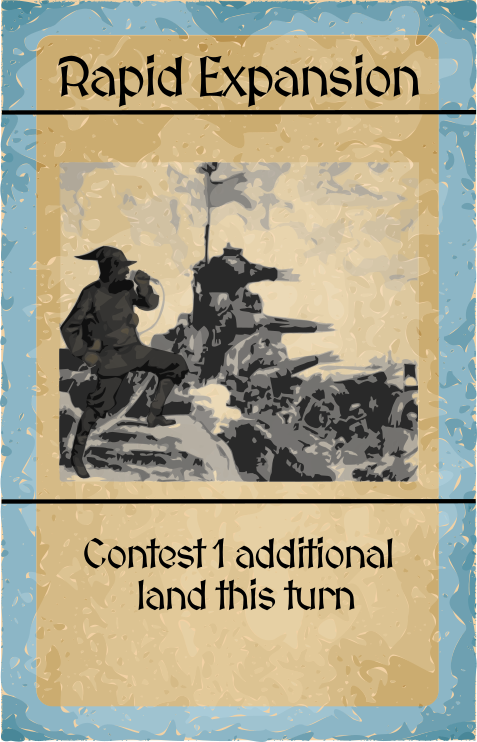 |
| Angel Investors | 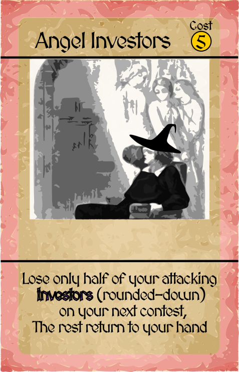 |
| Arcane Recession |  |
| Arcane Surge | 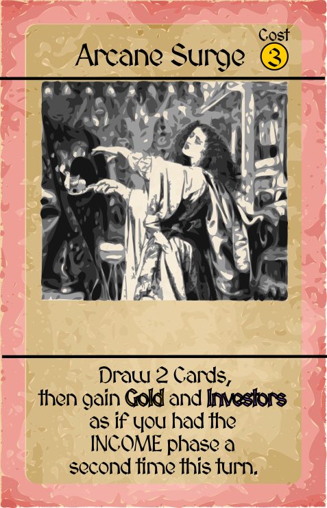 |
| Branch Office | 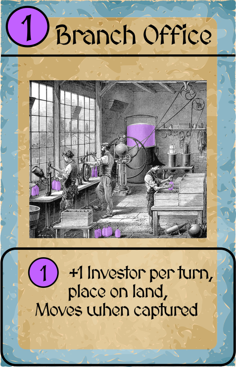 |
| Castle | 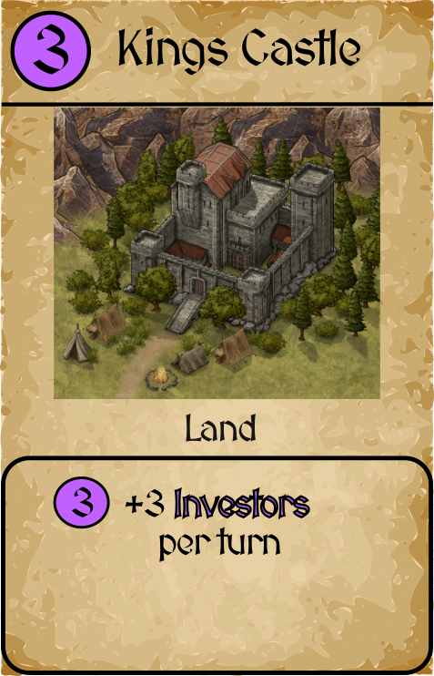 |
| City | 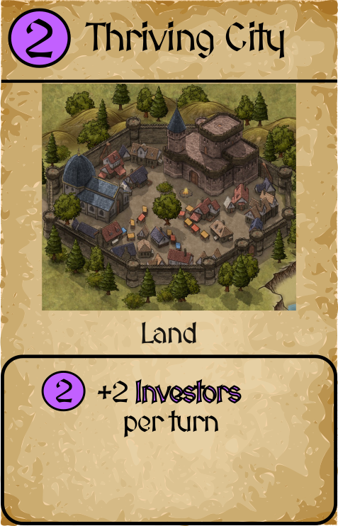 |
| Corporate Espionage | 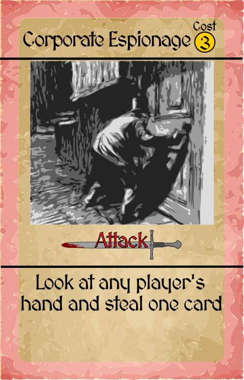 |
| Economic Dominance | 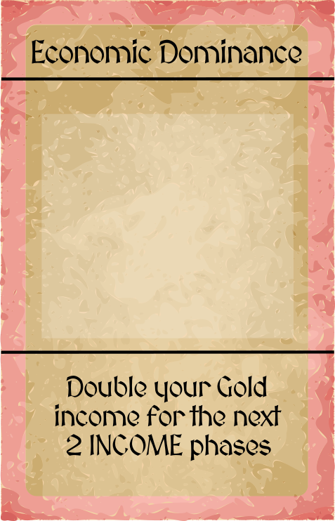 |
| Fortify | 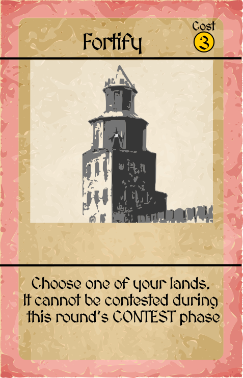 |
| Hamlet | 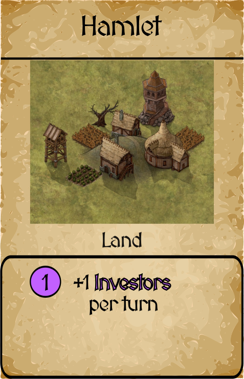 |
| Headhunt | 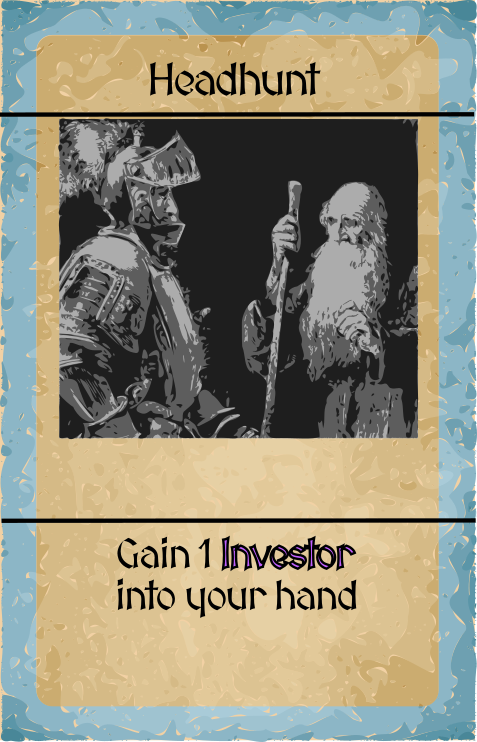 |
| Hostile Negotiation | 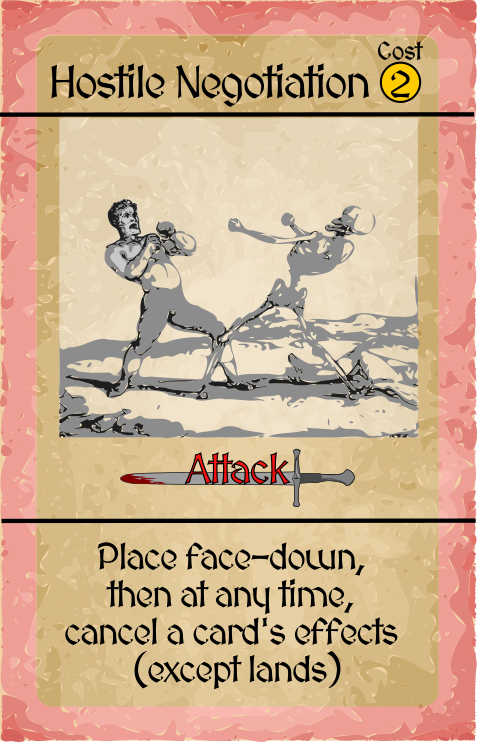 |
| Hostile Takeover | 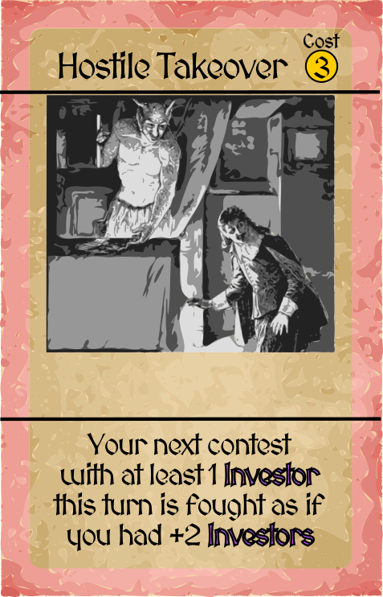 |
| Market Crash | 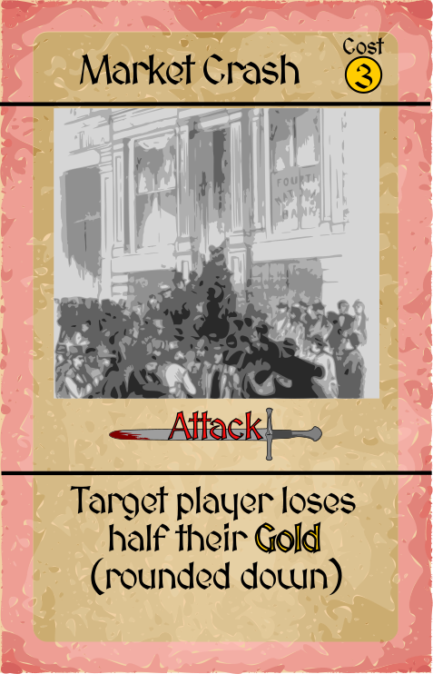 |
| Minor Export | 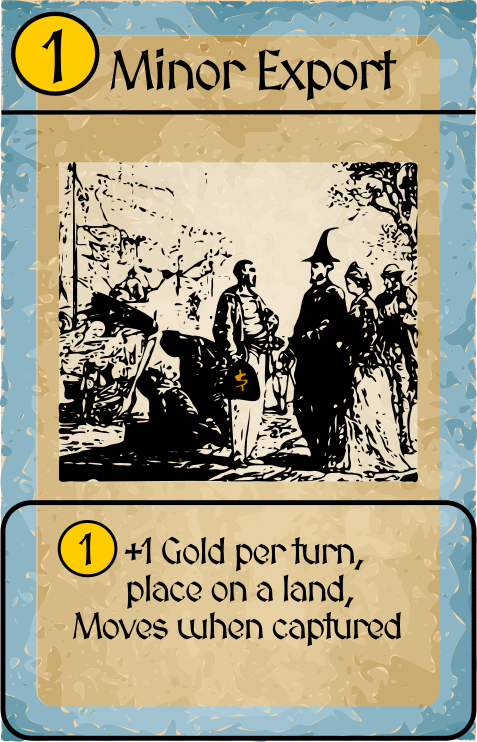 |
| Monopoly | 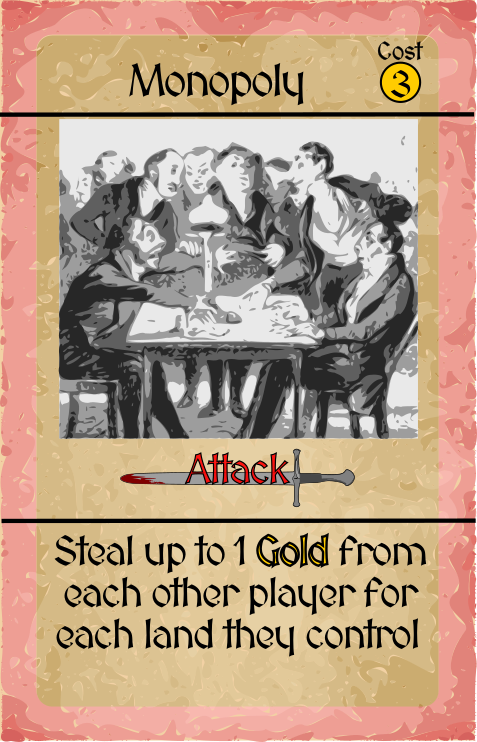 |
| Mystical Arbitrage | 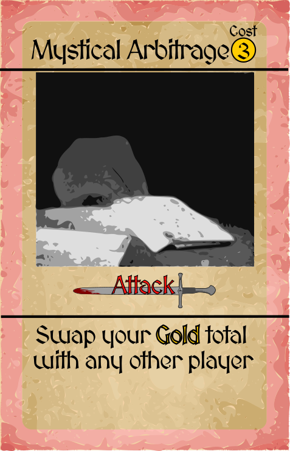 |
| Onboarding | 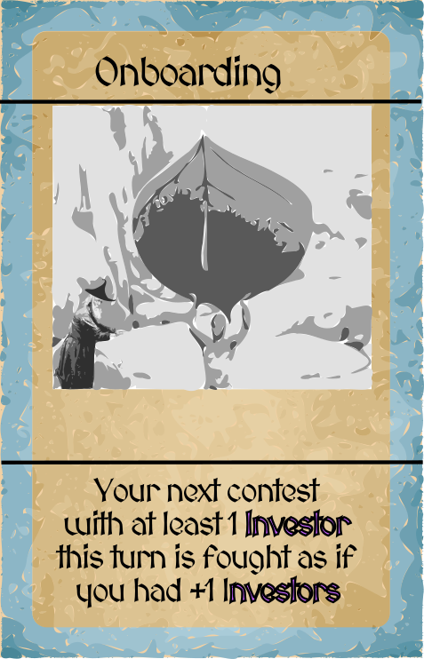 |
| Petty Cash | 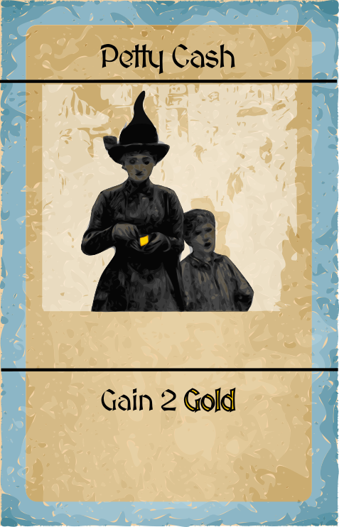 |
| Political Coup | 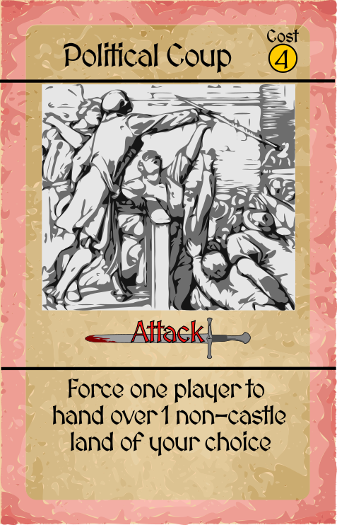 |
| Power Play | 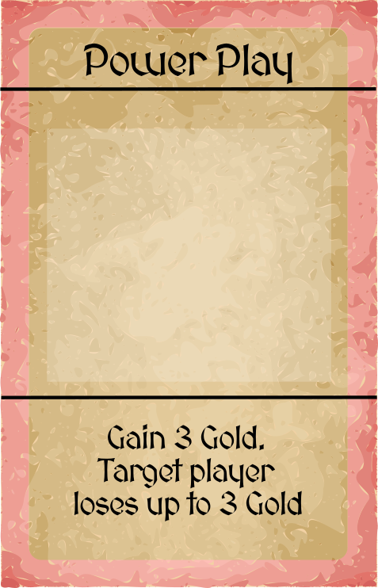 |
| Redeployment | 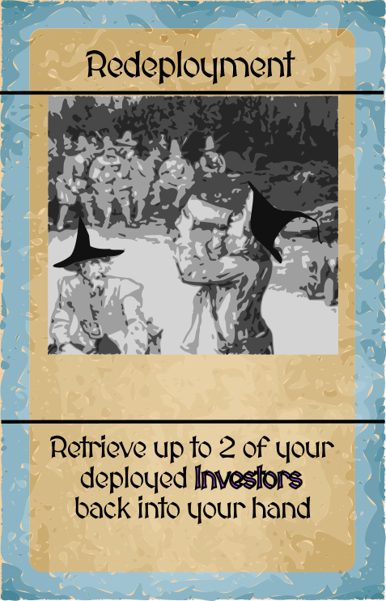 |
| Strike Action | 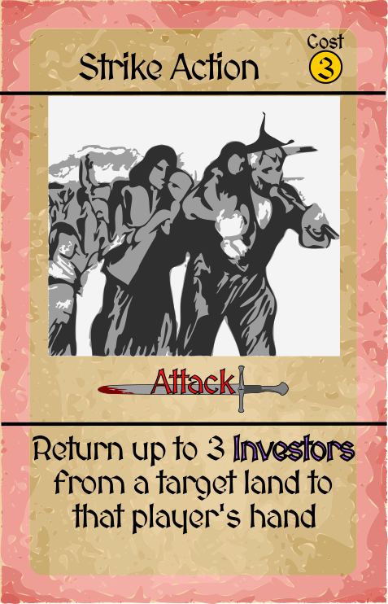 |
| Tax Collection | 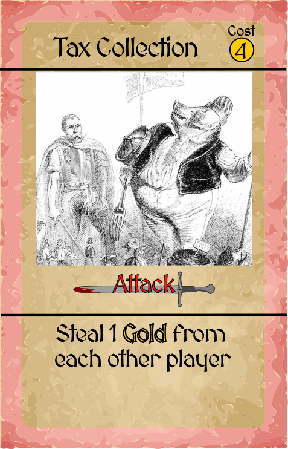 |
| Time Acceleration | 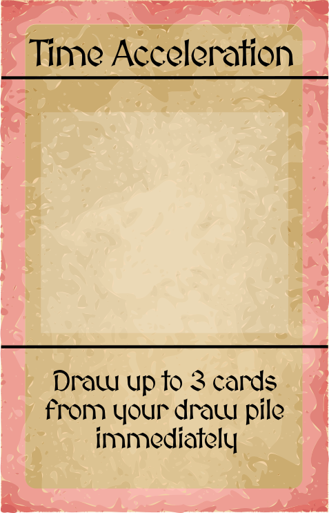 |

### Card Backs

| Draw | Market | Title |
|------|--------|-------|
| 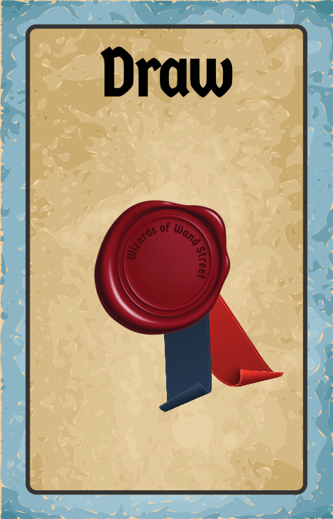 |  |  |
